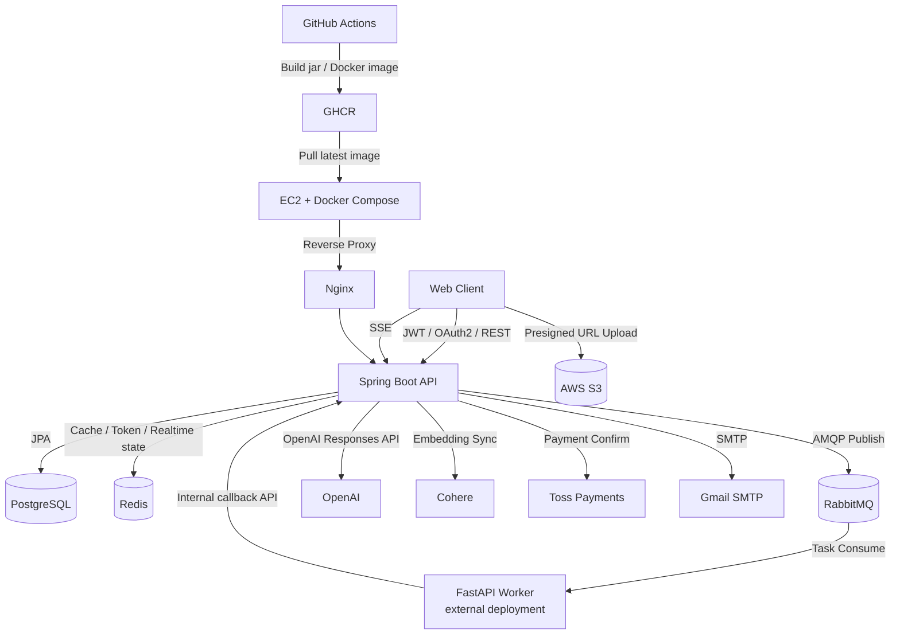
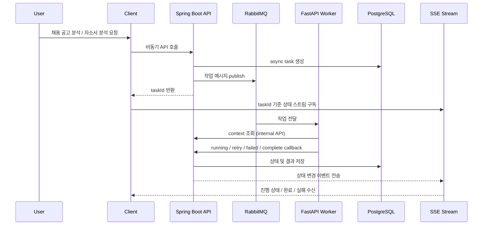

# JobDri SERVER

**AI 기반 채용 공고 정리 · 모의 지원서 생성 · 자소서 분석 플랫폼 `JobDri`의 백엔드 서버**입니다.

> **"채용 공고를 정리하고, 지원서를 만들고, 자소서까지 분석받자."**  
> 사용자가 업로드하거나 입력한 채용 공고를 AI가 구조화하고,  
> 직무/회사 기반의 **모의 공고와 문항**을 생성하며,  
> 작성한 자소서를 **AI 분석 + 실시간 상태 알림**으로 제공하는 **AI 취업 지원 플랫폼**입니다.

Server: `https://api.jobdri.site`

## 📖 프로젝트 소개

`JobDri`는 채용 공고부터 모의 지원, 자소서 분석까지 이어지는 지원 준비 흐름을 하나의 서비스 안에서 제공하는 백엔드입니다.

이 서버는 다음 흐름을 중심으로 동작합니다.

1. **채용 공고 입력/정리**
   사용자가 텍스트 또는 이미지 기반 공고를 입력하면 AI가 회사명, 직무명, 주요 업무, 자격 요건, 우대 사항을 구조화합니다.
2. **공고 저장 및 모의 지원 생성**
   저장된 실제 공고 또는 AI가 만든 모의 공고를 기반으로 `MockApply`를 생성하고, 추천 문항 또는 직접 추가 문항을 선택해 지원서를 작성합니다.
3. **자소서 분석**
   작성한 답변을 AI가 비동기로 분석하고, 점수/피드백/문항별 코멘트/누락 키워드를 저장합니다.
4. **실시간 상태 추적**
   긴 작업은 `RabbitMQ + 외부 FastAPI worker + internal callback API + SSE` 구조로 처리하며, 사용자는 진행 상태와 완료 알림을 실시간으로 확인할 수 있습니다.

## 🔄 Core Flow

### 1. 채용 공고 처리

- `POST /api/job-postings/extract`
  텍스트 또는 S3 이미지 object key를 받아 AI가 공고를 추출합니다.
- `POST /api/job-postings/ingest`
  공고 추출 → 분류 후보 탐색 → 공고 초안 생성 → 저장까지 비동기 작업으로 접수합니다.
- `GET /api/job-postings/ingest/async/{taskId}`
  비동기 상태를 조회합니다.
- `GET /api/job-postings/ingest/async/{taskId}/stream`
  SSE로 상태 변화를 구독합니다.

### 2. 모의 지원서 생성

- 저장된 실제 공고 기반 `ACTUAL` 타입 모의 지원 생성
- 저장된 공고 기반 `MOCK` 타입 모의 지원 생성
- 회사/직무 분류 기반 가상 공고 생성과 추천 질문 생성
- 같은 공고 기준 회차(`sequence`) 관리 및 재도전 생성

### 3. 자소서 작성 및 분석

- 문항 후보 조회, 직접 문항 추가, 선택 문항 저장
- 답변 저장/수정
- `POST /api/mock-applies/{mockApplyId}/analysis`
  자소서 분석 비동기 작업 접수
- `GET /api/mock-applies/{mockApplyId}/analysis`
  저장된 분석 결과 조회
- `GET /api/mock-applies/{mockApplyId}/analysis/async/{taskId}/stream`
  SSE 상태 스트림 구독

## 🛠️ Tech Stack

| Category | Stack |
| --- | --- |
| **Language** | Java 21 |
| **Framework** | Spring Boot 3.5.14 |
| **ORM / DB** | Spring Data JPA, PostgreSQL, H2(Test), pgvector |
| **Cache / Messaging** | Redis, RabbitMQ |
| **Auth / Security** | Spring Security, JWT, Google OAuth2 |
| **AI / Embedding** | OpenAI API (`gpt-4o-mini` default), Cohere Embedding (`embed-v4.0`) |
| **Storage / Infra** | AWS S3, Docker, GHCR, EC2, Nginx |
| **Payment** | Toss Payments |
| **Mail / Realtime** | JavaMailSender(Gmail SMTP), SSE |
| **Docs / Build** | SpringDoc Swagger, Gradle, GitHub Actions |

## ✨ Key Features

### 1. 인증 및 사용자 관리

- 이메일 인증번호 발송/검증 기반 회원가입
- JWT Access/Refresh Token 로그인 및 재발급
- Redis 기반 로그아웃/토큰 무효화 처리
- Google OAuth2 로그인 및 프론트 리다이렉트 연동

### 2. 채용 공고 AI 처리

- 공고 텍스트/이미지에서 구조화 정보 추출
- S3 presigned PUT URL 기반 이미지 직접 업로드
- 직무 소분류 자동 분류 후보 추천
- 회사/직무 기반 실제 공고 초안 생성
- 회사/직무 기반 모의 공고 및 추천 질문 생성

### 3. 모의 지원서 작성 흐름

- 실제 공고 기반 `ACTUAL` 타입 지원 생성
- 생성 공고 기반 `MOCK` 타입 지원 생성
- 질문 후보 조회 및 직접 문항 추가
- 선택 문항 저장 후 답변 작성 단계 전환
- 공고별 회차 관리 및 재도전 지원

### 4. 자소서 분석

- 비동기 분석 작업 접수 및 상태 조회
- 분석 완료 시 종합 점수, 항목별 점수, 전체 피드백 저장
- 문항별 분석 결과와 누락 키워드 제공
- 분석 실행 시 크레딧 1회 차감, 실패 시 환불

### 5. 결제 및 크레딧

- 크레딧 플랜 조회
- 토스페이먼츠 결제 준비/승인
- 사용자 크레딧 잔액/거래 내역 조회
- 기본 플랜
  `1회권`, `5회권`, `10회권`

### 6. 실시간 알림

- SSE 기반 인앱 알림 스트림
- 미읽음 개수 조회
- 개별/전체 읽음 처리
- 현재 구현된 주요 알림 타입
  `JOB_POSTING_ASYNC_SUCCEEDED`, `JOB_POSTING_ASYNC_FAILED`, `ANALYSIS_ASYNC_SUCCEEDED`, `ANALYSIS_ASYNC_FAILED`

### 7. 관리자 / 운영 기능

- corpus xlsx 적재 API
- corpus embedding 동기화 API
- 분석 retrieval preview 디버그 API
- 부트스트랩 관리자 이메일 승격
- 비동기 task timeout sweep 스케줄러
- 감사 로그 AOP (`@AuditLogEvent`)

## 🔍 상세 기능 명세

### 🧩 인증 및 유저

- `POST /api/auth/email-verifications`
- `POST /api/auth/email-verifications/confirmations`
- `POST /api/auth/signup`
- `POST /api/auth/login`
- `POST /api/auth/reissue`
- `POST /api/auth/logout`
- `GET /oauth2/authorization/google`
- `GET /login/oauth2/code/google`

### 🗂️ 직무 분류

- `GET /api/classifications`
- `GET /api/classifications/{bigId}/middles`
- `GET /api/classifications/middles/{middleId}/details`

### 📝 채용 공고

- `POST /api/job-postings`
- `PATCH /api/job-postings/{jobPostingId}`
- `GET /api/job-postings/me`
- `GET /api/job-postings/me/{jobPostingId}`
- `DELETE /api/job-postings/{jobPostingId}`
- `POST /api/job-postings/generate`
- `POST /api/job-postings/extract`
- `POST /api/job-postings/ingest`
- `GET /api/job-postings/ingest/async/{taskId}`
- `GET /api/job-postings/ingest/async/{taskId}/stream`
- `POST /api/job-postings/images/presign-upload`
- `POST /api/job-postings/extension/ingest`

### 🎯 모의 공고 / 모의 지원

- `POST /api/job-postings/mock/generate`
- `GET /api/job-postings/mock/questions`
- `POST /api/job-postings/mock/questions`
- `GET /api/mock-applies/me`
- `POST /api/mock-applies/actual`
- `POST /api/mock-applies/mock/from-job-posting`
- `POST /api/mock-applies/mock`
- `POST /api/mock-applies/{mockApplyId}/retry`
- `GET /api/mock-applies/{mockApplyId}/job-posting`
- `GET /api/mock-applies/{mockApplyId}/sequence`

### ✍️ 문항 / 답변 / 분석

- `GET /api/mock-applies/{mockApplyId}/questions/candidates`
- `POST /api/mock-applies/{mockApplyId}/questions/candidates`
- `GET /api/mock-applies/{mockApplyId}/questions`
- `PUT /api/mock-applies/{mockApplyId}/questions`
- `PATCH /api/mock-applies/{mockApplyId}/questions/answers`
- `POST /api/mock-applies/{mockApplyId}/analysis`
- `GET /api/mock-applies/{mockApplyId}/analysis`
- `GET /api/mock-applies/{mockApplyId}/analysis/async/{taskId}`
- `GET /api/mock-applies/{mockApplyId}/analysis/async/{taskId}/stream`
- `GET /api/job-postings/{jobPostingId}/analysis`

### 💳 결제 / 크레딧

- `GET /api/payments/plans`
- `POST /api/payments/prepare`
- `POST /api/payments/confirm`
- `GET /api/payments/credits/me`
- `GET /api/payments/credits/me/transactions`

### 🔔 알림

- `GET /api/notifications`
- `GET /api/notifications/unread-count`
- `GET /api/notifications/stream`
- `PATCH /api/notifications/{notificationId}/read`
- `PATCH /api/notifications/read-all`

### 🛠️ 관리자 / 워커 내부 API

- `POST /api/admin/corpus/import`
- `POST /api/admin/corpus/import/upload`
- `POST /api/admin/corpus/embeddings/sync`
- `POST /api/admin/analysis/retrieval-preview`
- `POST /api/internal/worker/job-postings/...`
- `POST /api/internal/worker/analysis/...`

## 🏛️ System Architecture

### 1. 전체 서버 아키텍처



### 2. 비동기 워커 처리 흐름



## 🔁 Async Worker Flow

이 서버의 핵심 비동기 작업은 `채용 공고 ingest`와 `자소서 분석` 두 종류입니다.

1. 사용자가 비동기 API를 호출합니다.
2. Spring 서버가 task row를 생성합니다.
3. Spring 서버가 RabbitMQ exchange/queue로 작업 메시지를 publish 합니다.
4. 외부 FastAPI worker가 메시지를 consume 합니다.
5. worker는 필요 컨텍스트를 internal API로 조회합니다.
6. worker가 AI 처리 결과를 internal callback API로 완료/실패 반영합니다.
7. Spring 서버가 DB 저장, 알림 생성, SSE 상태 전파를 수행합니다.

## 📂 Project Structure

```bash
com.jobdri.jobdri_api
├── domain
│   ├── analysis        # 자소서 분석, 질문 선택, async task, worker bridge
│   ├── auth            # 회원가입, 로그인, 이메일 인증, OAuth2
│   ├── classification  # 대/중/소분류 직무 체계 조회
│   ├── company         # 회사 엔티티
│   ├── corpus          # corpus 적재, 임베딩 동기화, retrieval
│   ├── jobposting      # 공고 저장/수정/생성/추출/ingest/extension 연동
│   ├── mockapply       # 모의 지원 생성, 회차, 재도전
│   ├── notification    # SSE 알림, 읽음 처리
│   ├── payment         # 크레딧, 결제, 거래 내역
│   ├── audit           # 감사 로그 AOP
│   ├── user            # 사용자 도메인
│   └── skill / experience
├── global
│   ├── apiPayload      # 공통 응답/에러 코드
│   ├── config          # Security, Swagger, RabbitMQ, AWS S3, Async 설정
│   ├── jwt             # JWT 필터/유틸
│   ├── mq              # RabbitMQ publish support
│   ├── scheduling      # async timeout sweep scheduler
│   ├── security        # UserDetails, internal API key validator
│   └── sse             # SSE subscription registry
└── resources
    ├── application*.yaml
    └── schema.sql
```

## 🚀 Local Run

### 1. 애플리케이션 실행

```bash
cp .env.example .env
./gradlew bootRun
```

기본 포트:

- API: `http://localhost:8080`
- Swagger: `http://localhost:8080/swagger-ui/index.html`

### 2. 테스트 실행

```bash
./gradlew test
```

테스트 환경은 `H2 (MODE=PostgreSQL)`를 사용합니다.

### 3. Docker Compose

```bash
cp .env.example .env
docker compose up --build
```

포함 의도 서비스:

- Spring Boot API
- PostgreSQL
- Redis
- RabbitMQ
- external FastAPI worker 연결용 worker service 정의


## ⚙️ Environment

주요 환경 변수:

- `DB_URL`, `DB_USERNAME`, `DB_PASSWORD`
- `REDIS_HOST`, `REDIS_PORT`
- `RABBITMQ_HOST`, `RABBITMQ_PORT`, `RABBITMQ_USERNAME`, `RABBITMQ_PASSWORD`
- `JWT_SECRET_KEY`, `JWT_ACCESS_TOKEN_EXPIRATION`, `JWT_REFRESH_TOKEN_EXPIRATION`
- `MAIL_HOST`, `MAIL_USERNAME`, `MAIL_PASSWORD`
- `GOOGLE_CLIENT_ID`, `GOOGLE_CLIENT_SECRET`
- `OPENAI_API_KEY`
- `COHERE_API_KEY`
- `AWS_ACCESS_KEY_ID`, `AWS_SECRET_ACCESS_KEY`, `AWS_REGION`, `S3_BUCKET`
- `TOSS_CLIENT_KEY`, `TOSS_SECRET_KEY`
- `APP_WORKER_INTERNAL_API_KEY`

worker 연동 관련 기본 queue 설정:

- `APP_WORKER_JOB_POSTING_QUEUE=jobdri.job-posting.ingest`
- `APP_WORKER_ANALYSIS_QUEUE=jobdri.analysis.execute`

## 🧠 Corpus / Retrieval

이 프로젝트는 단순 LLM 호출만 사용하는 구조가 아니라, corpus 기반 retrieval를 함께 사용합니다.

- 채용 공고 corpus 적재
- 질문 corpus 적재
- Cohere 임베딩 생성
- pgvector 저장
- 모의 공고 생성 및 자소서 분석 시 retrieval context 참고
- 관리자 preview API로 retrieval 결과 사전 점검 가능

Python 스크립트도 포함되어 있습니다.

- `scripts/import_corpus.py`
- `scripts/sync_corpus_embeddings.py`

## 🚀 Deployment Pipeline

GitHub Actions 기준 배포 흐름:

1. `main`, `dev` 브랜치 push 또는 PR 발생
2. CI에서 JDK 21 기반 `./gradlew clean test` 실행
3. Docker image build
4. Deploy workflow에서 GHCR에 이미지 push
5. 배포 secret이 존재하면 원격 서버에 SSH 접속
6. 서버에서 `docker compose -f docker-compose.prod.yml pull api`
7. `docker compose -f docker-compose.prod.yml up -d api`

## 📝 API Documentation

SpringDoc Swagger UI:

- Local: `http://localhost:8080/swagger-ui/index.html`
- Production: `https://api.jobdri.site/swagger-ui/index.html`

추가 공개 경로:

- OpenAPI docs: `/v3/api-docs`
- Health check: `/actuator/health`

## 📌 현재 구현 범위

- 이메일 인증 기반 로컬 회원가입/로그인
- Google OAuth2 로그인
- JWT 인증/인가 및 로그아웃 처리
- 직무 대/중/소분류 조회
- 채용 공고 생성/수정/조회/삭제
- 채용 공고 이미지 presigned upload
- AI 채용 공고 추출
- AI 채용 공고 초안 생성
- AI 모의 공고 생성
- 추천 질문 캐시 및 조회
- 실제/모의 공고 기반 모의 지원 생성
- 질문 선택, 직접 문항 추가, 답변 저장
- 자소서 분석 비동기 처리
- 크레딧 차감/환불
- 토스 결제 연동
- SSE 알림
- 관리자 corpus import / embedding sync
- RabbitMQ 기반 외부 worker 연동용 internal API
- async timeout sweep scheduler
- 감사 로그 적재
